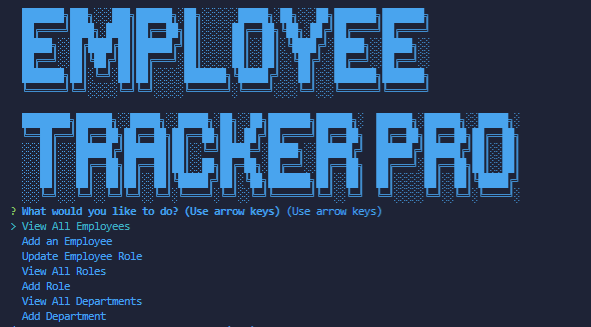

# Employee Tracker Pro

## Welcome to Employee Tracker Pro, an application created to assist you.

This application allows users to maintain database for employees/managers and their departments. Using this application, a user can view departments, roles, employees, add departments/roles/employees and update employees. These feature allow for a quick and stable way to change and maintain the data for work.

## Table of Contents

- [Usage](#usage)
- [Installation](#installation)
- [License](#license)
- [Contribution](#contribution)
- [Tests](#tests)
- [Questions](#questions)

## Usage

Efficiency, data management, employee/manager salary tracking

## Installation

express / console Table/ inquirer/jest/nodemon

## License

[]

## Contribution

gsaaad

## Tests

Jest

## Questions

If you have questions, email me @ : gsparqcode@gmail.com/ Github: [gsaaad](https://github.com/gsaaad)
